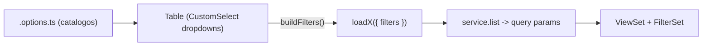

# Mapeo de filtros de opciones (backend -> front)

> Alcance: SOLO mapeo + plan (este documento). No se modifica codigo de los
> modulos todavia. Se incluyen unicamente los filtros que tienen sentido como
> **dropdown de opciones** para el usuario (los FK internos se excluyen).

## Patron de referencia

La pagina `src/features/academic/teacher-subject-section/TeacherSubjectSectionPage.tsx`
implementa los filtros asi:

- Los dropdowns viven en el header de la tabla
  (`components/TeacherSubjectSectionTable.tsx`) usando `CustomSelect`.
- Los catalogos de cada dropdown se cargan en
  `teacher-subject-section.options.ts` (hook generico `useCatalogOptions` +
  `useTeacherAssignmentFilters`).
- El estado de cada filtro vive en la tabla; `buildFilters()` arma el objeto
  `FiltersT` (descartando `0` / `""`) y `fetchData()` lo pasa a
  `loadX({ ..., filters })`.
- El service serializa `filters` como query params: `&<key>=<value>`
  (ver `teacher-subject-section.service.ts`).
- Los tipos definen `FiltersT` y `ListParamsT` incluye `filters?: FiltersT`.

## Mapeo backend -> front (solo filtros con dropdown util)

### academic

- `TeacherSubjectSection` (`back/apps/academic/api/filters.py`):
  `school_year`, `academic_grade`, `section`, `subject`, `user`, `is_active`.
  Front: `src/features/academic/teacher-subject-section/` — YA IMPLEMENTADO
  (referencia).

### iam

- `UserViewSet` -> `UserFilter` (`back/apps/iam/api/filters.py`):
  `role_id` (dropdown roles), `is_active` (dropdown estado). `dni` queda como
  texto/busqueda. Front: `src/features/iam/users/UserPage.tsx`.
  Gap: `users.service.ts` `list` NO envia filtros aun (requiere ampliar tipos +
  service).
- `RoleViewSet` -> `RoleFilter`: `is_active` (dropdown estado).
  Front: `src/features/iam/roles/RolePage.tsx`.
- `PermissionViewSet` -> `PermissionFilter`: `module` (dropdown de modulos).
  Front: `src/features/iam/permissions/PermissionPage.tsx`.

### students

- `StudentViewSet` -> `StudentFilter` (`back/apps/students/api/filters/filters.py`):
  `is_active` (dropdown estado). `names` / `last_names` / `document_number` /
  `student_code` ya son texto (search). Front:
  `src/features/students/student/StudentPage.tsx`.
  Nota: `student.service.ts` `list` YA acepta estos params; solo falta UI.
- `StudentRepresentativeViewSet`: `student` (dropdown estudiante),
  `is_primary` (dropdown si/no). `user` es interno. Front:
  `src/features/students/representative/RepresentativePage.tsx`.
- `EnrollmentViewSet`: `section` (dropdown seccion),
  `enrollment_status` (dropdown estado matricula), `student` (dropdown
  estudiante). Front: `src/features/students/enrollments/EnrollmentsPage.tsx`.

### behavior

- `ConductIncidentViewSet`: `enrollment` (dropdown matricula/estudiante).
  Front: `src/features/behavior/conduct-incident/ConductIncidentPage.tsx`.
- `BehaviorEvaluationViewSet`: `enrollment` (dropdown),
  `academic_period` (dropdown periodo). Front:
  `src/features/behavior/behavior-evaluation/BehaviorEvaluationPage.tsx`.

### analytics

- `StudentRiskScoreViewSet` -> `StudentRiskScoreFilter`
  (`back/apps/analytics/api/filters.py`): `risk_label`
  (dropdown rojo/amarillo/verde), `academic_period` (dropdown periodo). Front:
  `src/features/analytics/RiskScoreListPage.tsx`.
- `StudentFeatureSnapshotViewSet`: `academic_period` (dropdown).
  `enrollment` interno. Front: visor read-only (opcional).

### grading (contexto docente; dropdowns utiles)

- `EvaluativeActivityViewSet`: `academic_period` (dropdown),
  `teacher_subject_section` (dropdown asignacion). Front:
  `src/features/grading/evaluative-activities/EvaluativeActivitiesPage.tsx`.
- `BlockComponentViewSet`: `evaluation_block` (dropdown),
  `academic_period` (dropdown), `is_active` (dropdown). Front:
  `src/features/grading/block-components/BlockComponentsPage.tsx`.
- `PeriodGradeSummaryViewSet`: `academic_period` (dropdown). Front:
  `src/features/grading/period-grade-summaries/PeriodGradeSummariesPage.tsx`.
- `StudentNoteViewSet`: filtros `enrollment` / `evaluative_activity` son
  internos -> NO se exponen como dropdowns (excluido por acuerdo).

## Pasos de implementacion por modulo (cuando se apruebe ejecutar)

Para cada modulo de la lista, replicar el patron de referencia:

1. **Tipos** (`<module>.types.ts`): agregar
   `interface <Module>FiltersT { ... }` y `filters?: <Module>FiltersT` dentro de
   `ListParamsT`.
2. **Service** (`<module>.service.ts`): en `list`, serializar `params.filters`
   como query params (igual que en la referencia). En modulos cuyo service ya
   acepta params sueltos (ej. `student`) consolidar bajo `filters` o mantener
   compatibilidad.
3. **Options** (`<module>.options.ts`): crear hook(s) que carguen los catalogos
   de cada dropdown (roles, secciones, periodos, etc.) reutilizando services
   existentes; los dropdowns de catalogo fijo (estado, `risk_label`,
   `is_primary`, `module`) se definen inline.
4. **Tabla** (`components/<Module>Table.tsx`): agregar estado por filtro,
   `buildFilters()`, un `CustomSelect` por cada filtro y un `useEffect` que
   re-consulta al cambiar filtros (patron de la referencia).
5. **Verificacion**: `npm run typecheck` + `npm run lint`.

## Reutilizacion recomendada

- **Promover `useCatalogOptions`** (hoy en
  `src/features/academic/teacher-subject-section/teacher-subject-section.options.ts`)
  a `src/shared/` (p.ej. `src/shared/hooks/useCatalogOptions.ts`) para no
  duplicarlo en cada modulo. Recomendacion: hacerlo ANTES de implementar el
  primer modulo nuevo de filtros, para que todos lo consuman desde `@shared`.
- Centralizar el `selectClassNames` de los dropdowns de filtro en el design
  system (`@app/styles/styles`) en lugar de redefinirlo en cada tabla.
